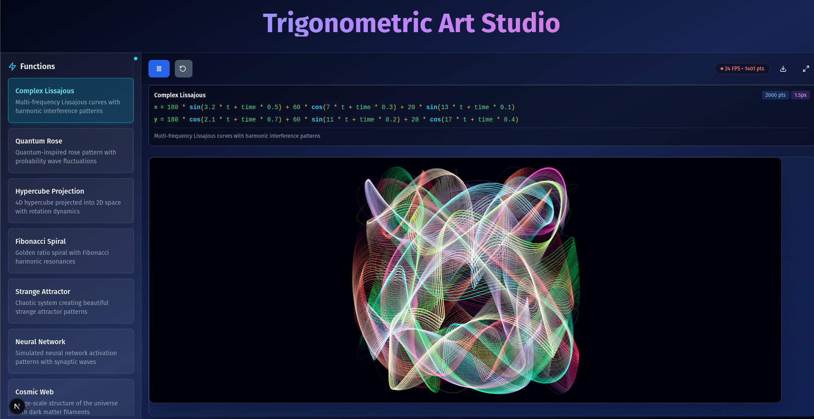

# Trigonometric Art Studio



A cutting-edge mathematical art generator that transforms complex trigonometric functions into stunning visual masterpieces.

## ✨ Features

### 🌀 Complex Lissajous Patterns

- Multi-frequency harmonic interference patterns
- Dynamic parameter controls for real-time manipulation
- Smooth animation with time-based transformations

### ⚛️ Quantum Rows

- Probability wave fluctuations visualization
- Quantum-inspired pattern generation
- Interactive wave function controls

### 🔶 Hypercube Projections

- 4D hypercube projections into 2D space
- Real-time rotation dynamics
- Customizable projection parameters

### 🌌 Fibonacci Spirals

- Golden ratio-based spirals
- Harmonic resonance visualization
- Adjustable growth factors

### 🌀 Strange Attractors

- Chaotic system pattern generation
- Beautiful emergent structures
- Parameter tuning for unique patterns

### 🧠 Neural Network Visualizations

- Simulated neural activation patterns
- Synaptic wave propagation
- Custom network architecture inputs

### 🌐 Cosmic Web

- Large-scale universe structure simulations
- Dark matter filament visualizations
- Interactive scaling and exploration

## 🚀 Getting Started

### Prerequisites

- Node.js 16+
- npm/yarn
- Modern browser with WebGL support

### Installation

```bash
git clone https://github.com/yourusername/trigonometric-art-studio.git
cd trigonometric-art-studio
npm install
npm run dev
```

## 🎨 Example Function

### Complex Lissajous

```javascript
x =
  100 * sin(3.2 * t + time * 0.5) +
  60 * cos(7 * t + time * 0.3) +
  20 * sin(13 * t + time * 0.1)

y =
  100 * cos(2.1 * t + time * 0.7) +
  60 * sin(11 * t + time * 0.2) +
  20 * cos(17 * t + time * 0.4)
```

## 📊 Performance Features

- WebGL-accelerated rendering
- Adaptive quality scaling
- Real-time performance metrics
- GPU-optimized calculations

## 🤝 Contributing

We welcome contributions! Please see our [Contribution Guidelines](CONTRIBUTING.md).

## 📜 License

MIT License - see [LICENSE](LICENSE) for details.

## 🌟 Showcase

Check out our [Gallery](https://example.com/gallery) for stunning examples of generated art.

---

<div align="center">
  <p>Created with ❤️ by Trigonometric Art Studio</p>
  <p>Explore the beauty of mathematics through art</p>
</div>
